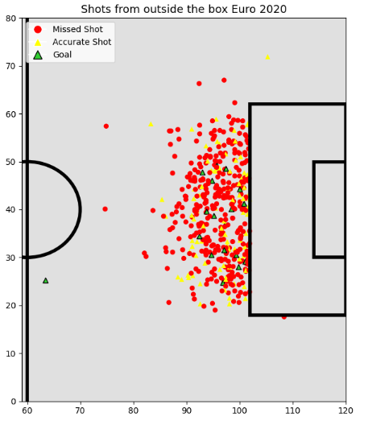
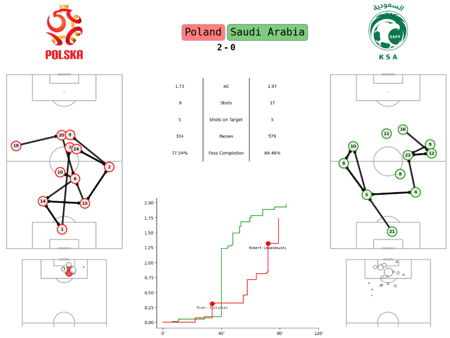
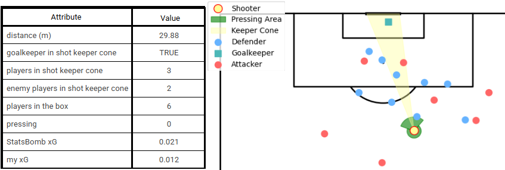
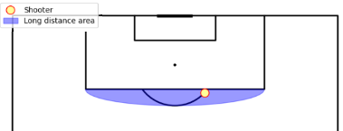
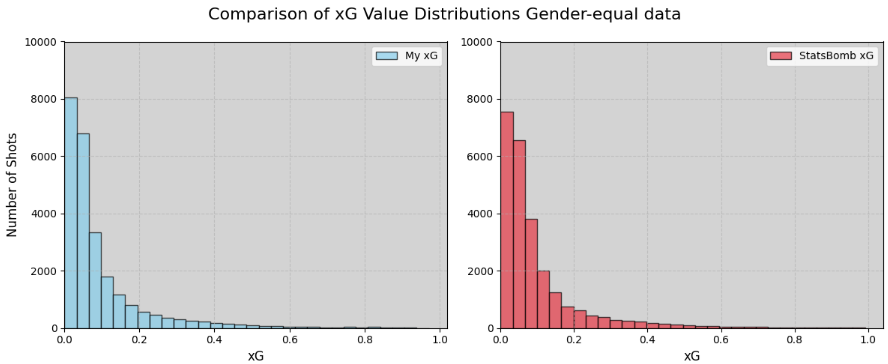

# ⚽ An AI-driven approach to adapting the Expected Goals (xG) model to women’s football

This project introduces a data-driven methodology to tailor the **Expected Goals (xG)** model specifically for women’s football. While xG is widely used in modern football analytics, existing models often neglect biomechanical and tactical differences observed in the women's game.

By incorporating novel contextual features such as **Defensive Congestion Index (DCI)**, **Shot Block (SB)**, and training neural networks with various input combinations, this work significantly improves the model’s predictive accuracy.

The project leverages the **Hudl StatsBomb Open Data** and was developed as part of a master's thesis and a funded research initiative: **IDUB Research Project No. 134**. The final results were presented at the **6th Polish Conference on Artificial Intelligence (PP-RAI’2025)** additionally the organizers are committed to publishing my scientific article in September.

---

## 📚 Background and Project Evolution

Initial steps were exploratory, as documented in [`first_analysis.ipynb`](beginnings/first_analysis.ipynb), where different ideas and directions were tested. The goal was to find a topic suitable for both academic research and grant application.

<p align="center">
  
  <br>
  <em>This pitch was hand-drawn using basic geometry and Matplotlib. It represents one of the earliest stages of the project when I wasn't aware of Statsbombpy Pitch.</em>
</p>

After receiving the grant, I enrolled in several courses, including the **McKayJohns' course**, where I developed an interactive [`dashboard.ipynb`](courses/dashboard.ipynb):

<p align="center">
  
  <br>
  <em>An interactive dashboard that quickly presents crucial match statistics.</em>
</p>

Eventually, I narrowed the focus to the xG model for women's football. This final direction led to a successful presentation at the **PP-RAI’2025** conference.

- 🔗 [Article (PDF)](article_PP-RAI2025.pdf)
- 🔗 [Conference poster (PDF)](poster_PP-RAI2025.pdf)
- 🔗 [Oral presentation (Google drive link)](https://drive.google.com/file/d/1Y9GE6d4SyDwuiMwcwkkVlx0UsKMR5eIo/view?usp=sharing)

---

## 🤖 Final xG Model

The core part of the project lives in the [`my_xG/`](my_xG/) directory, which contains:

- `data_preparation.ipynb`: generates the input dataset `equal_dataframe.csv`.
- `my_xG.ipynb`: main analysis and neural network implementation.

At the start of the notebook, you can choose whether to train the model once or 10 times. Running it 10 times improves stability but increases runtime.

<p align="center">
  
  <br>
  <em>
    I added five custom parameters, which are important to the model and helped reduce the log loss:
    <ul>
      <li>Pressing</li>
      <li>Players in the box</li>
      <li>Players in shot-keeper cone</li>
      <li>Opponent players in shot-keeper cone</li>
      <li>Goalkeeper in shot-keeper cone</li>
    </ul>
  </em>
</p>

### 🧠 Model Architecture

- Logistic regression as the baseline model  
- Multilayer Perceptron with 3 hidden layers: 64, 64, 32 neurons, using a ReLU activation function  
- Output layer with 1 neuron using a sigmoid activation function  
- Optimizer: Adam  
- Loss function: Binary cross-entropy  
- Evaluation metric: Log loss

---

## 🎯 Long-range Shots & Tactical Context

As part of the analysis, I examined how long-range shots differ between men's and women's football, uncovering key distinctions that highlight the importance of adapting xG models to women’s football.

<p align="center">
  
  <br>
  <em>Shot from the picture is not long-range.</em>
</p>

---

## 📊 Results

<p align="center">
  
  <br>
  <em>Distribution of predicted probabilities vs Statsbombs.</em>
</p>

### 📈 Long-range Shot Statistics Comparison

| **Metric**                               | **Female** | **Male** |
|------------------------------------------|------------|----------|
| Total long-range shots                   | 3,507      | 3,554    |
| Long-range goals                         | 129        | 87       |
| Long-range shot accuracy (Goals/Shots)   | 3.68%      | 2.45%    |
| Long-range shot frequency (Shots/All)    | 26.90%     | 29.28%   |
| Long-range goals share (Goals/All Goals) | 0.99%      | 0.72%    |

The analysis revealed a **notable distinction between women’s and men’s football** — specifically, the prevalence and characteristics of **long-range goals** in the women’s game. This finding reinforces the need for a dedicated women’s xG model that is more sensitive to long-range shot patterns.

The study provided a deeper understanding of the women’s football context. The custom model, **my xG**, after incorporating additional variables (_SB + DCI_), **reduced the log loss from 0.273 to 0.260**. Importantly, **most newly added features ranked among the most influential variables** in the model.

---

<pre> ## 📂 Repository Structure ``` women_football_xG/ ├── README.md ├── article_PP-RAI2025.pdf ├── poster_PP-RAI2025.pdf ├── presentation_PP-RAI2025.pdf ├── beginnings/ │ └── first_analysis.ipynb ├── courses/ │ ├── dashboard.ipynb │ └── match_prediction.ipynb ├── my_xG/ │ ├── data_preparation.ipynb │ ├── my_xG.ipynb │ └── equal_dataframe.csv ├── images/ │ ├── additional_parameters.png │ ├── drawn_pitch.png │ ├── dashboard.png │ ├── long-range_shot.png │ └── xG_distribution.png ``` </pre>